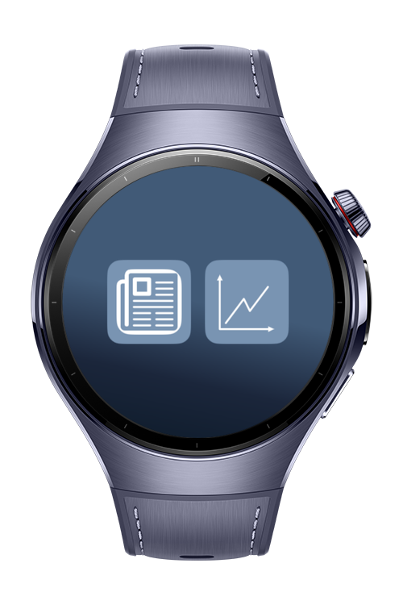
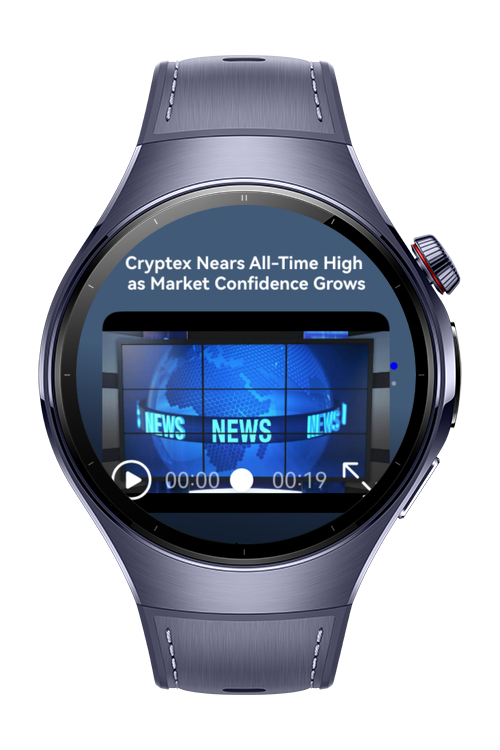

> **Note:** To access all shared projects, get information about environment setup, and view other guides, please visit [Explore-In-HMOS-Wearable Index](https://github.com/Explore-In-HMOS-Wearable/hmos-index).

# Stock Tracker
This demo showcases a stock tracking application built with HarmonyOS NEXT APIs.

## Preview
<div>




</div>

# Use Cases
- Track stock market data with interactive charts
- View recent financial news
- Watch financial video content
- Navigate through a user-friendly interface

# Tech Stack
- **Languages**: ArkTS
- **Frameworks**: HarmonyOS SDK 5.1.0(18)
- **Tools**: DevEco Studio Version 5.1.0.828
- **Libraries**
  - `@ohos.charts`: VChart library for interactive stock charts
  - `@ohos.mediakit`: Video playback functionality

# Directory Structure
```
entry/src/main/ets/
|---viewmodel                      // Data models for the application
|---pages
|   |---MenuPage.ets               // Main menu interface
|   |---ChartsPage.ets             // Stock charts visualization 
|   |---NewsPage.ets               // Financial news display
|---components                     // Reusable UI components
|---model                          // Data structures and interfaces
|---entryability                   // Application entry point
|---entrybackupability             // Backup functionality
|---resources
    |---base/media                 // Application media assets
        |---line_chart_icon.svg    // Chart visualization icon
        |---news.svg               // News section icon
        |---sample.mp4       // Sample financial news video
```

# Constraints and Restrictions

## Supported Devices

- Huawei Watch 5

# LICENSE

**Stock Tracker** is distributed under the terms of the MIT License.
See the [license](/LICENSE) for more information.